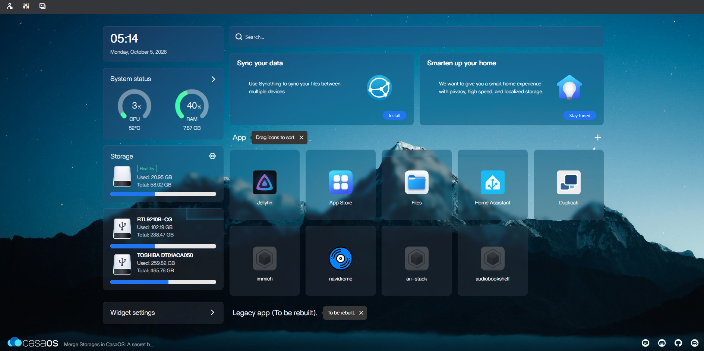
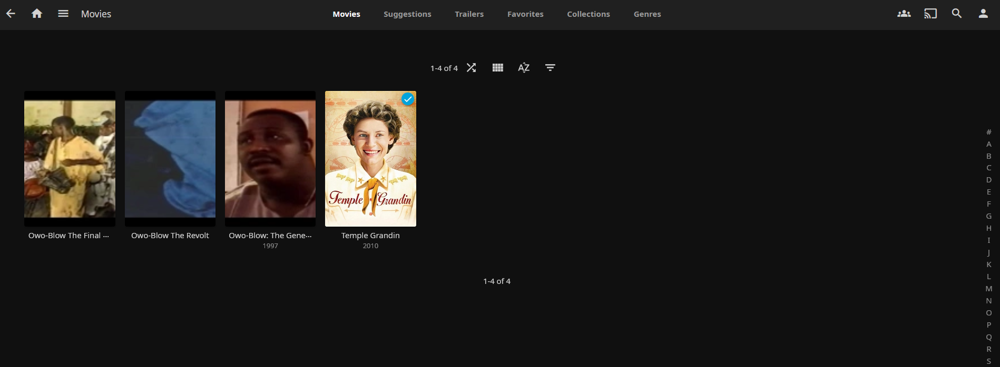
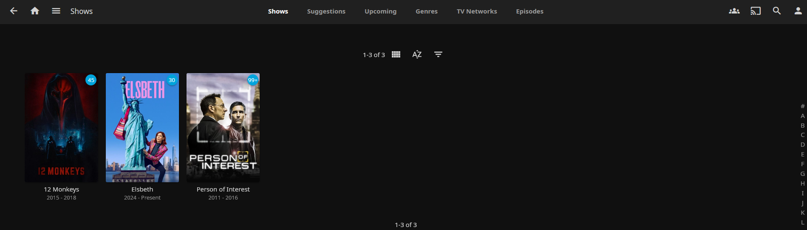
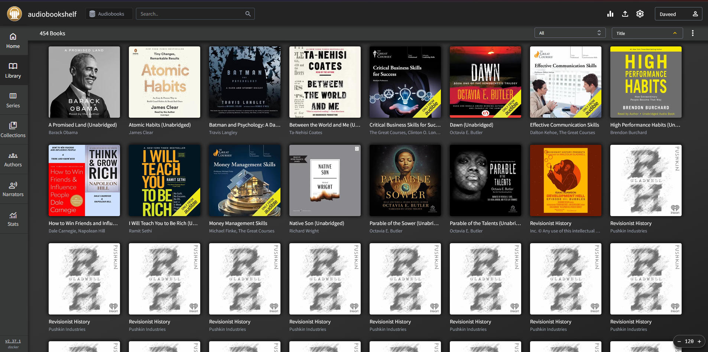
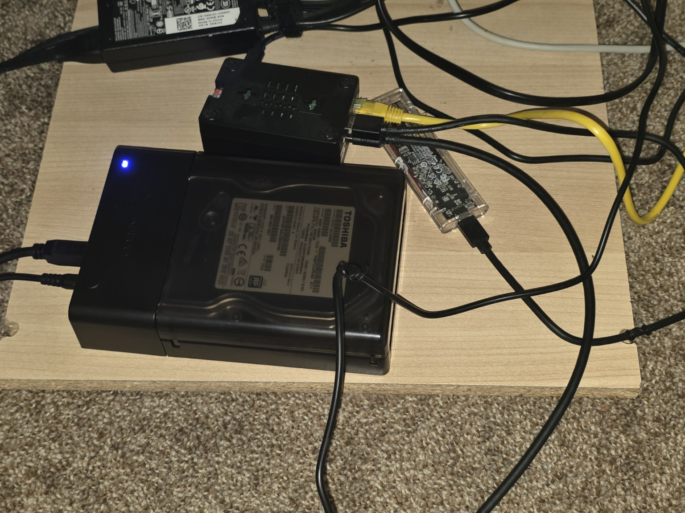
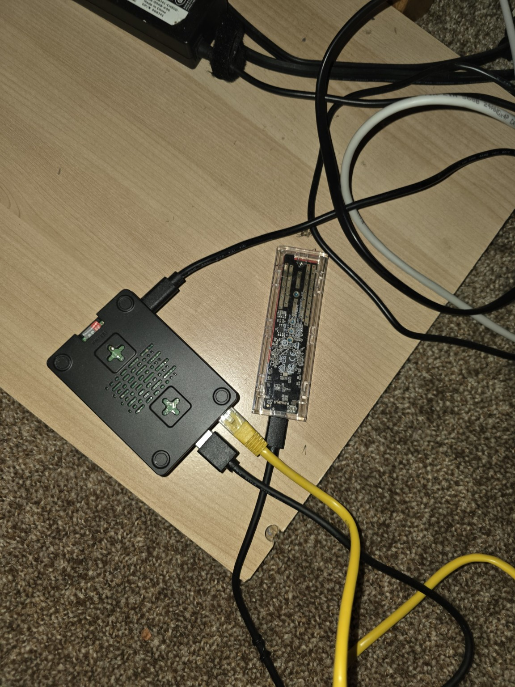
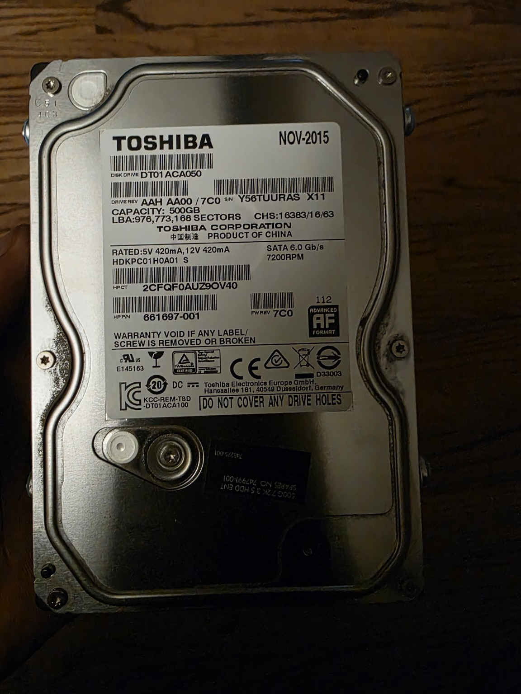

# Raspberry Pi 5 Media Server

A self-hosted media server built by David Lawal to organize movies,
TV shows, personal videos, and audiobooks.

## Dashboard

CasaOS dashboard showing the running applications and storage usage.

## Jellyfin Libraries

Separate libraries organize movies and TV shows.

### Movies

### TV Shows

## Audiobookshelf Library

I imported audiobooks from my personal Audible library into
Audiobookshelf. I used Libation on my Windows computer to download
and prepare the books, then copied them to the Raspberry Pi’s
external drive and scanned them into Audiobookshelf.

This project included organizing book folders, matching metadata,
checking for duplicate audio files, and confirming playback.
 

## Hardware

Raspberry Pi 5 with 8GB RAM, external storage and microSD card for the operating system

256GB USB SSD connected to the Pi.

  
500GB Toshiba SATA hard drive connected through a powered USB dock

## Software

| Tool | Purpose |
|---|---|
| Debian 12 and CasaOS | Server operating system and management |
| Docker Compose | Container deployment |
| Jellyfin | Movies, TV shows, and personal videos |
| Audiobookshelf | Audiobooks and ebooks |
| Radarr and Sonarr | Movie and TV library management |
| Prowlarr | Indexer management |
| qBittorrent | Download client |
| Tailscale | Private remote access |

## Storage Organization

The Toshiba drive is mounted at `/mnt/PiMedia`.

Separate folders hold movies, TV shows, home videos, audiobooks,
application settings, and backups. Persistent container mounts keep
application data available when containers are recreated.

## Completed and Tested

- Configured persistent external storage.
- Played Jellyfin media on a laptop and Samsung TV.
- Configured separate administrator and regular user accounts.
- Restricted access to personal video libraries.
- Set up automatic subtitle downloads.
- Imported audiobooks and confirmed playback in Audiobookshelf.
- Checked audio files for duplicates using SHA-256 hashes.
- Moved identical duplicates outside the audiobook library for review.
- Organized multipart movies into separate folders and verified playback.

## Troubleshooting Experience

- Corrected file permissions during duplicate cleanup.
- Resolved a Jellyfin server compatibility issue with the TV client.
- Renamed and reorganized movies to prevent unwanted grouping.
- Distinguished local network addresses from Tailscale remote addresses.

## Skills Practiced

Linux administration, Docker Compose, storage mounting, file permissions,
media organization, access control, backups, and troubleshooting.

## Next Improvements

- Back up Audiobookshelf settings and media to another device.
- Verify Audiobookshelf recovery after a Pi restart.
- Protect container startup when the external drive is unavailable.
- Add configuration examples and screenshots.

## Repository Scope

This repository documents the lab. Media files, passwords, API keys,
and private configuration backups are excluded.
